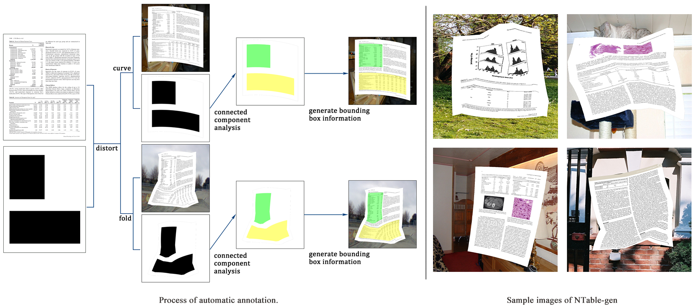

    
 
# NTable: A Dataset for Camera-based Table Detection 

Most of the existing table detection methods are designed for scanned document images or Portable Document Format (PDF). And tables in the real world are seldom collected in the current mainstream table detection datasets. Therefore, we construct a dataset named NTable for camera-based table detection. NTable consists of a smaller-scale dateset NTable-ori, an augmented dataset NTable-cam, and a generated dataset NTable-gen. More details are available in our paper "NTable: A Dataset for Camera-based Table Detection".

## Description
**NTable-ori** is made up of 2.1k+ images taken by different cameras and mobile phones. We provide two classification methods, one is based on the source, the other is based on the shape (see Examples). According to the source, NTable-ori can be divided into textual, electronic and wild. According to the shape, NTable-ori can be divided into upright, oblique and distorted. Table 1 counts the classification results.
 

Table 1. Classification results of NTable-ori.

<table align="center">
   <tr>
      <td>category </td>
      <td colspan = "3" align="center">source </td>
      <td colspan = "3" align="center">shape</td>
   </tr>
   <tr>
      <td> subcategory </td>
      <td> textual </td>
      <td> electronic </td>
      <td> wild </td>
      <td> upright </td>
      <td> oblique </td>
      <td>distorted </td>
   </tr>
   <tr align="center">
      <td># of pages </td>
      <td>1674</td>
      <td>254</td>
      <td>198</td>
      <td>758</td>
      <td>421</td>
      <td>947</td>
   </tr>
</table>
 
**NTable-cam** is augmented from NTable-ori. By changing rotation, brightness and contrast, original 2.1k+ images are expanded eightfold to 17k+ images (see Examples).
 
**NTable-gen** is a synthetic dataset, it simulates as much as possible the various deformation conditions, which is to address the limitations of the current data, ulteriorly improve data richness. We chose [PubLayNet](https://github.com/ibm-aur-nlp/PubLayNet) as the original document images. There are 86950 pages with at least one table in PubLayNet’s training set. We randomly select 8750 pages. Background images are from the [VOC2012](http://host.robots.ox.ac.uk/pascal/VOC/voc2012/) dataset (see Examples).

## Get data
NTable-gen:
[Link 1 (Google Drive)](https://drive.google.com/drive/folders/15WgiBtpJZLAL3bOXC7ALHPw7fHxHfa7d?usp=sharing),
Link 2 (Baidu Disk)
 
The original NTable-ori and NTable-cam:
[Link 1 (Google Drive)](https://drive.google.com/drive/folders/1tcuPwuRK4pzm7NRJj_u9d6foyFduvAs3?usp=sharing),
Link 2 (Baidu Disk)
 
We collected 607 new images, including 1000 tables. The statistics are shown in Table 2. Download link of the updated NTable-ori and NTable-cam：
[Link 1 (Google Drive)](https://drive.google.com/drive/folders/1OBhJMswdc3DTxDQg7axcT3qkeXUCqgaF?usp=sharing),
Link 2 (Baidu Disk)
 

Table 2. Classification results of the new images.

<table align="center">
   <tr>
      <td>category </td>
      <td colspan = "3" align="center">source </td>
      <td colspan = "3" align="center">shape</td>
   </tr>
   <tr>
      <td> subcategory </td>
      <td> textual </td>
      <td> electronic </td>
      <td> wild </td>
      <td> upright </td>
      <td> oblique </td>
      <td>distorted </td>
   </tr>
   <tr align="center">
      <td># of pages </td>
      <td>285</td>
      <td>195</td>
      <td>484</td>
      <td>396</td>
      <td>221</td>
      <td>347</td>
   </tr>
</table>

## Annotation format
The annotation files follows the format of YOLO, [x, y, w, h] determines a bounding box, (x, y) is the coordinate of the center of the bounding box, w and h is the normalized width and height of the bounding box, where w is the width of the bbox divided by the width of the image,  h is the height of the bbox divided by the height of the image.

## Add new images
We provide the code to add new images into NTable. Here are the steps to enlarge NTable: 
1. Use [Labelme](https://github.com/wkentaro/labelme) to annotate the images, it will generate a json file for every image. 
2. Put the images and annotations into ./orimage
3. Run anno_aug.py, it will separately append the original images, the augmented images and the corresponding annotations into ./NTable-ori and ./NTable-cam

## Examples

## Note
1. The classification is subjective. For example, you may find some tables that have been classified as 'upright' also have some slight deformation or tilts.
2. There are some clerical errors in the tables in our paper. The correct tables are as follows:

Table 3. Statistics of training, validation and test sets in NTable.

<table align="center">
   <tr align="center">
      <td></td>
      <td>training</td>
      <td>validation</td>
      <td>test</td>
   </tr>
   <tr align="center">
      <td>NTable-cam</td>
      <td>11904</td>
      <td>1696</td>
      <td>3408</td>
   </tr>
   <tr align="center">
      <td>NTable-gen</td>
      <td>11984</td>
      <td>1712</td>
      <td>3424</td>
   </tr>
   <tr align="center">
      <td>total</td>
      <td>23888</td>
      <td>3408</td>
      <td>6832</td>
   </tr>
</table>

Table 4. Statistics of each category and subcategory in NTable-cam.

<table align="center">
   <tr align="center">
      <td rowspan = "2"></td>
      <td colspan = "3">source</td>
      <td colspan = "3">shape</td>
   </tr>
   <tr align="center">
      <td>textual</td>
      <td>electronic</td>
      <td>wild</td>
      <td>upright</td>
      <td>oblique</td>
      <td>distorted</td>
   </tr>
   <tr align="center">
      <td>train</td>
      <td>7152</td>
      <td>1336</td>
      <td>3416</td>
      <td>3072</td>
      <td>2136</td>
      <td>6696</td>
   </tr>
   <tr align="center">
      <td>validation</td>
      <td>944</td>
      <td>200</td>
      <td>552</td>
      <td>464</td>
      <td>304</td>
      <td>928</td>
   </tr>
   <tr align="center">
      <td>test</td>
      <td>2064</td>
      <td>288</td>
      <td>1056</td>
      <td>912</td>
      <td>600</td>
      <td>1896</td>
   </tr>
</table>
 
## Acknowledgement
I would like to thank [@Jotaro-Kujo](https://github.com/Jotaro-Kujo), Zhang Meiqing and Zhu Chaowen. In the process of collecting data, they offered great help. 
